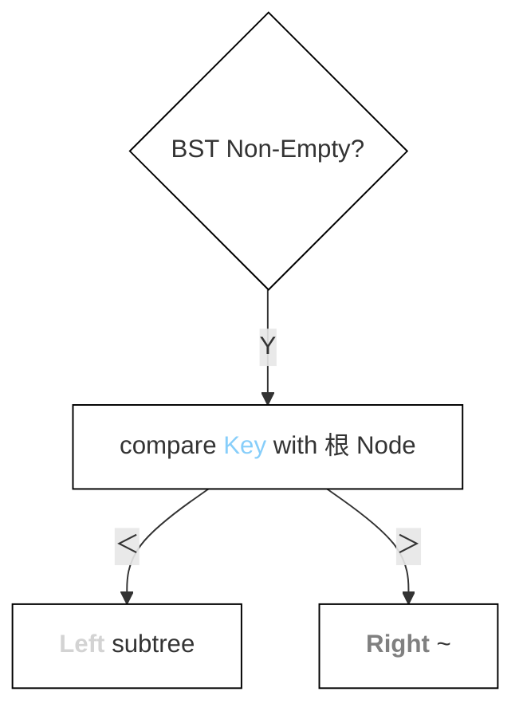
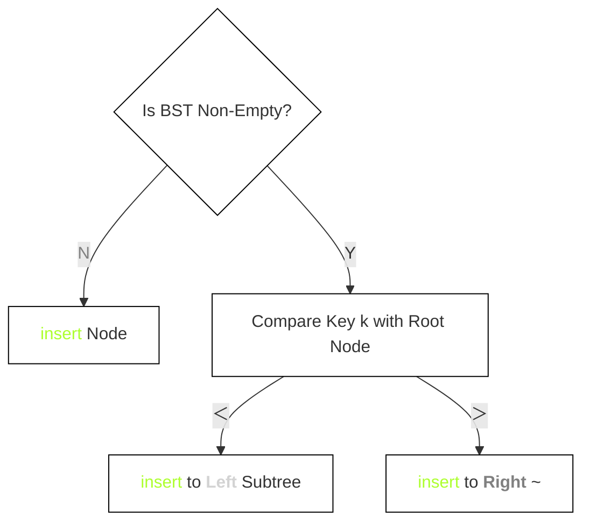

<div style="float: left; width: 64%; padding: 1%;">


## <span style="color: silver;"><span style="color: Gold;">二叉</span><span style="color: GreenYellow;">排序</span><span style="color: green;">树</span>（BST）

Binary sort tree

- 目的：
  - 不是用于排序
  - 是为了提高以下操作的效率：
    - 关键字<span style="color: Gold;">search</span>
    - ~<span style="color: GreenYellow;"><span style="color: GreenYellow;">插入</span></span>
    - ~<span style="color: gray;">删除</span>
- 优势：
  - 非线性结构
  - 这种结构特别有利于：
    - <span style="color: GreenYellow;"><span style="color: GreenYellow;">插入</span></span>
    - <span style="color: gray;">删除</span>

<ul>

### <span style="color: silver;">定义

> pro：二叉排序树的应用（2013）

二叉排序树（也称二叉<span style="color: Gold;">search</span>树）或者是一棵空树，或者是具有下列特性的二叉树：

- if 左子树非空
  - → 左子树上所有node的值 all＜根node的值
- if 右子树非空
  - → 右子树上所有node的值all＞根node的值
- 左、右子树也分别是一棵二叉排序树

> pro：二叉排序树中node值之间的关系（2015、2018）

- 根据二叉排序树的定义:
  - 左子树node值$<$根node值$<$右子树node值
  - 对BST 中序遍历，可以得到一个递增的<span style="color: gray;">有</span><span style="color: LightSkyBlue;">序</span>序列
  - 例如，图7.4所示二叉排序树的中序遍历序列为123468


图7.4一棵二叉排序树

</ul>

<ul>

### <span style="color: silver;">基本操作

<ul>

#### <span style="color: Gold;">search</span>

- 过程：
  - 从根node开始，along某个分支layer by layer向下比较
  - if BST 非空：
    - compare 关键字of 给定值 & 根node
      - if = → <span style="color: Gold;">search</span>成功
      - if ≠ 
        - ＜ 关键字 of 根node → 根node的左子树上<span style="color: Gold;">search</span>
        - ＞ 关键字 of 根node → 根node的右子树上<span style="color: Gold;">search</span>

- 非递归<span style="color: Gold;">search</span>算法：

```c
BSTNode *BST<span style="color: Gold;">search</span>(BiTree T,ElemType key)( 
    while(T!=NULL&&key != T->data){ 
      if（key<T->data）T=T->1child；
      elseT=T->rchild; 
    }
    returnT;  
```

- eg：
  - 在图7.4中<span style="color: Gold;">search</span>值为4的node
    - 首先4与根node6比较
      - 4＜6
        - 在根node6的左子树中继续<span style="color: Gold;">search</span>
      - 4＞2
        - 在node2的右子树中<span style="color: Gold;">search</span>
        - <span style="color: Gold;">search</span>成功

</ul>

<ul>

#### <span style="color: GreenYellow;"><span style="color: GreenYellow;">插入</span>

- 特点：
  - 树的结构usually not一次生成的
  - 在<span style="color: Gold;">search</span>过程中
    - when 树中 not exist 关键字值 = 给定值的node时 → <span style="color: GreenYellow;">插入</span>

- <span style="color: GreenYellow;">插入</span>过程：
  - if 原BST=空
    - → 直接<span style="color: GreenYellow;">插入</span>
  - else：
    - 关键字k＜根node值
      - → <span style="color: GreenYellow;">插入</span> <b><span style="color: lightgray;">Left</span></b> subtree
    - 关键字k＞根node值
      - → <span style="color: GreenYellow;">插入</span> <b><span style="color: gray;">Right</span></b> ~
-  <span style="color: silver;">notice:</span>
   - <span style="color: GreenYellow;">插入</span>的node must is 一个 new added 叶node

`  
图7.5向二叉排序树中<span style="color: GreenYellow;">插入</span>node

- <span style="color: GreenYellow;">插入</span>算法：

```c
int BST Insert（BiTree &T，KeyType k）(
  if（T==NULL)(
    T = (BiTree)malloc（sizeof（BSTNode));
    T->data = k
    T->lchild = T->rchild = NULL;
    return1;
  else if(k=T->data)
    return 0;
  else if(k<T->data)
    return BST Insert(T->lchild,k);
  else
    return BST Insert（T->rchild,k);
```

</ul>

<ul>

#### <span style="color: Lime;">构造</span>

> pro: <span style="color: Lime;">构造</span>二叉排序树的过程（2020）

- 过程：
  - from空树<span style="color: GreenYellow;">出发
  - <u>依次</u><span style="color: gray;">输入</span>元素
  - insert元素to合适位置

 
图7.6二叉排序树的<span style="color: Lime;">构造</span>过程

- <span style="color: Lime;">构造</span>算法：

```c
void Creat BST（BiTree &T，KeyType str[],int n){
    T = NULL;
    int i = 0
    while(i < n)
      BSTInsert(T,str[i]);
```

</ul>

<ul>

#### ❓<span style="color: gray;">删除

- 过程：
  - can't
    - 以该node为<u>根</u>' 子树上的node都delete
  - must重新
    - link 断开的<span style="color: Gold;">二叉</span><span style="color: RoyalBlue;">链</span>表
  - ensure
    - 二叉排序树的<span style="color: Gold;">性质</span>不会丢失

- 情况：
  1. just 叶node：
     - directly 删除
  2. node_z only一棵子树：
     - 让z的子树成为z父node的子树
  3. 🌟node_z have 左、右subtree：
     - 令z的直接后继（或直接前驱）替代z
     - 从二叉排序树中删去这个直接后继（或直接前驱）← ❓ 这个81是哪来的

 
3种情况下的删除过程

> pro：二叉排序树中删除并<span style="color: GreenYellow;">插入</span>某node的分析（2013）

</ul>

</ul>

<ul>

### ❓<span style="color: silver;"><span style="color: Gold;">search</span><span style="color: RoyalBlue;">效率</span>分析

- 影响因素：
  - main:树的<span style="color: LightSkyBlue;"><span style="color: LightSkyBlue;">高度</span></span>
    - <span style="color: Goldenrod;">平衡</span><span style="color: Gold;">二叉</span><span style="color: green;">树</span>[^1]：
      - <span style="color: LightSkyBlue;">平均</span><span style="color: Gold;">search</span>长度为O(log₂n)
    - 单支树：
      - ~O(n)

- worst： ← ❓ 这是不是就是退化成 链表 的情况
  - 输入序列
    - <span style="color: gray;">有</span><span style="color: LightSkyBlue;">序</span>
  - 形成倾斜的<span style="color: GreenYellow;">单</span>支树
  - 树的<span style="color: LightSkyBlue;">高度</span>increase to元素个数n

 
图7.8相同关键字组成的不同二叉排序树

- <span style="color: LightSkyBlue;">平均</span><span style="color: Gold;">search</span>长度比较：
  - 图7.8(a)：ASL=(1+2×2+3×4+4×3)/10=2.9 ← ❓ 长度whether 按照node数算
  - 图7.8(b)：ASL=(1+2+3+4+5+6+7+8+9+10)/10=5.5

- 与 二分<span style="color: Gold;">search</span>[^2] 比较： ← ❓ 为什么一个only 一个 not
  - <span style="color: LightSkyBlue;">平均</span>时间性能相似
  - 二分<span style="color: Gold;">search</span> 判定树 唯一
  - BST <span style="color: Gold;">search</span>不唯一

- 维护表的<span style="color: gray;">有</span><span style="color: LightSkyBlue;">序</span>性：
  - BST：
    - 无须移动node
    - only modify 指针
    - <span style="color: LightSkyBlue;">平均</span>执行时间O(log₂n)
  - 二分<span style="color: Gold;">search</span>：
    - 对象是<span style="color: gray;">有</span><span style="color: LightSkyBlue;">序</span>顺序表
    - <span style="color: GreenYellow;">插入</span>删除操作代价O(n)
  - 选择建议：
    - <span style="color: LightSkyBlue;">静</span>态<span style="color: Gold;">search</span>表：用顺序表+二分<span style="color: Gold;">search</span>
    -  <span style="color: GreenYellow;">动</span>态<span style="color: Gold;">search</span>表：BST

</ul>

</ul>

<ul>


</div>
<div style="float: right; width: 26%; padding: 1%;">

##  <span style="color: silver;">key


- 中序遍历 is a way of 二叉树遍历
  - 左子树 → 根节点 → 右子树

###  <span style="color: silver;">操作
<ul>

 <span style="color: Gold;">search</span>
- process
  - layer by layer


 <span style="color: GreenYellow;">插入</span>
- process


<span style="color: Lime;">构造</span>
- process

 

<span style="color: gray;">删除
- 情况：
  1. just 叶node：
     - directly 删除
  2. node_z only一棵子树：
     - 让z的子树成为z父node的子树
  3. 🌟node_z have 左、右subtree：
     - 令z的直接后继（或直接前驱）替代z
     - 从二叉排序树中删去这个直接后继（或直接前驱）← ❓ 这个81是哪来的

 
</ul>

### <span style="color: silver;"><span style="color: Gold;">search</span> ASL & 二分( <span style="color: Gold;">折</span>半)

- <span style="color: Goldenrod;">平衡</span><span style="color: Gold;">二叉</span><span style="color: green;">树</span>


 

  - (a)：ASL=(1+2×2+3×4+4×3)/10=2.9 

- choice
  - <span style="color: LightSkyBlue;">静</span>态<span style="color: Gold;">search</span>表：用顺序表+二分<span style="color: Gold;">search</span>
  -  <span style="color: GreenYellow;">动</span>态<span style="color: Gold;">search</span>表：BST

</div>
<div style="clear: both;"></div>

[^1]: <span style="color: Goldenrod;">平衡</span>二叉树（Balanced Binary Tree）a special BST
    - every node'左右子树'Height difference ≤1
      - goal
        - avoid BST在退化为<span style="color: RoyalBlue;">链</span>表in extreme cases
        - thereby ensuring 时间复杂度=$O(log_2{n})$ 

[^2]: 二分search 即  <span style="color: Gold;">折</span>半~